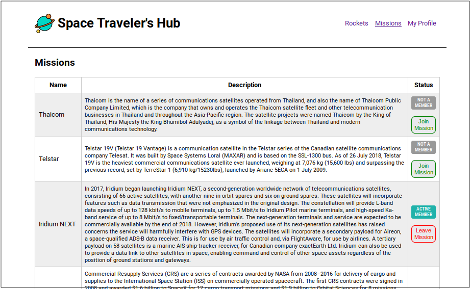

# Space Traveler's Hub

> An educational project to use React, React Router, Redux,...

## Built With

- React
- Redux

## Live Demo

[Live Demo Link](https://sth-bonke-ahangarha.herokuapp.com/)

## Getting Started

To get a local copy up and running follow these simple example steps.

### Prerequisites

You need nodejs and npm installed on your machine. If so, continue with the next steps.

### Setup

Install dependencies by running:

`npm install`

### Usage

Run live server by the following command:

`npm start`

### Run tests

`npm test`

### Deployment

To deploy this project run the following command:

`npm build`

and copy the content of `build` directory to the root folder of your production environment.

## Authors

👤 **Bonke Gcobo**

- GitHub: [@BonkeGcobo](https://github.com/BonkeGcobo)
- Twitter: [@bonke_gcobo](https://twitter.com/bonke_gcobo)
- LinkedIn: [LinkedIn](https://linkedin.com/in/bonke-gcobo-28a763125)

👤 **Mostafa Ahagnarha**

- GitHub: [@ahangarha](https://github.com/ahangarha)
- Twitter: [@ahangarha](https://twitter.com/ahangarha)
- LinkedIn: [LinkedIn](https://linkedin.com/in/ahangarha)

## 🤝 Contributing

Contributions, issues, and feature requests are welcome!

Feel free to check the [issues page](../../issues/).

## Show your support

Give a ⭐️ if you like this project!

## Acknowledgments

- Linters configuration are made by Microverse
- The logo has been taken from flaticon.com.

## 📝 License

This project is [MIT](./LICENSE.md) licensed.
